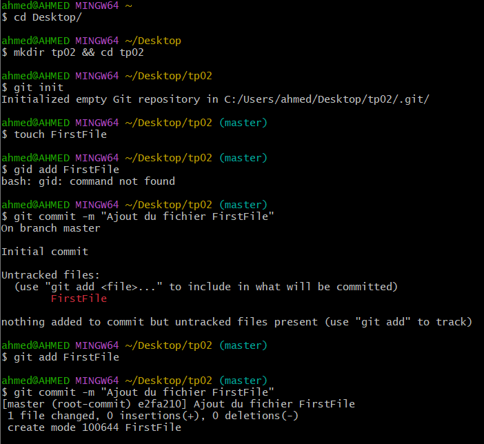
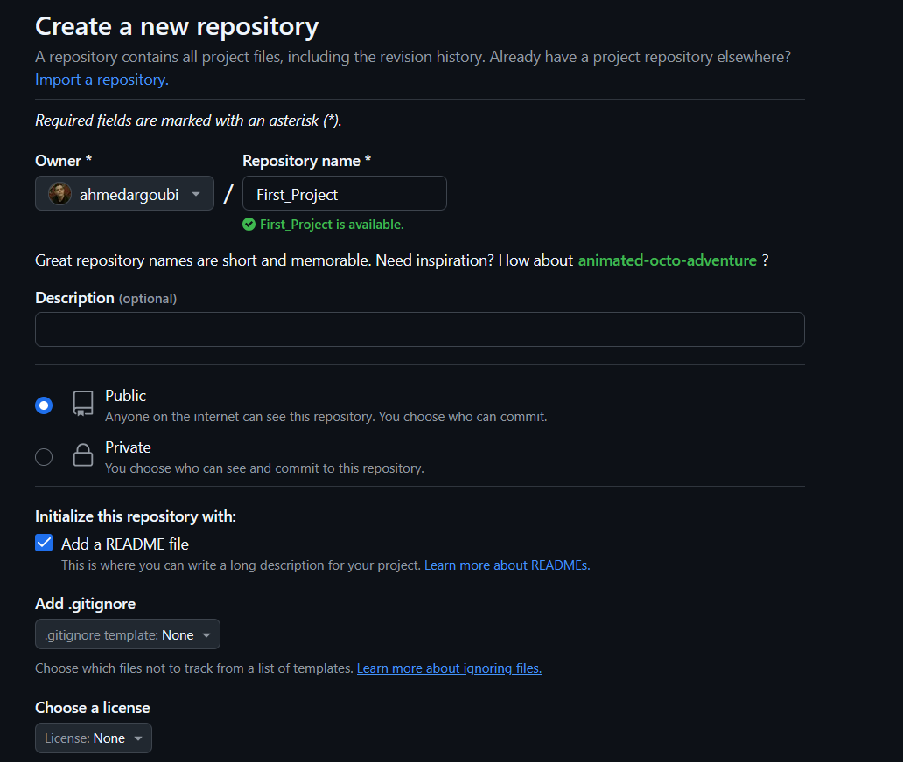
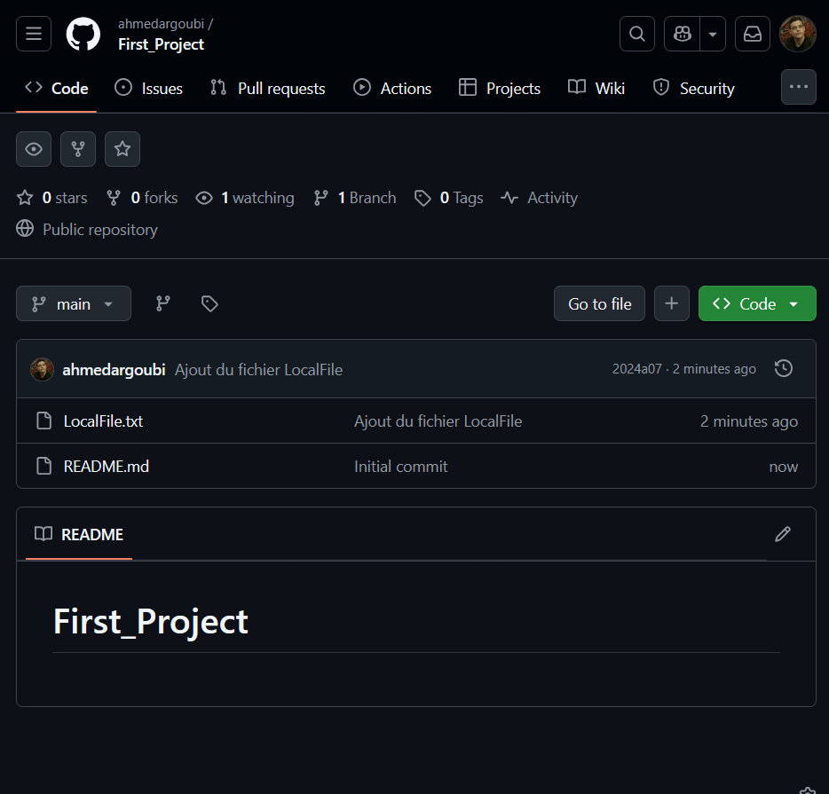
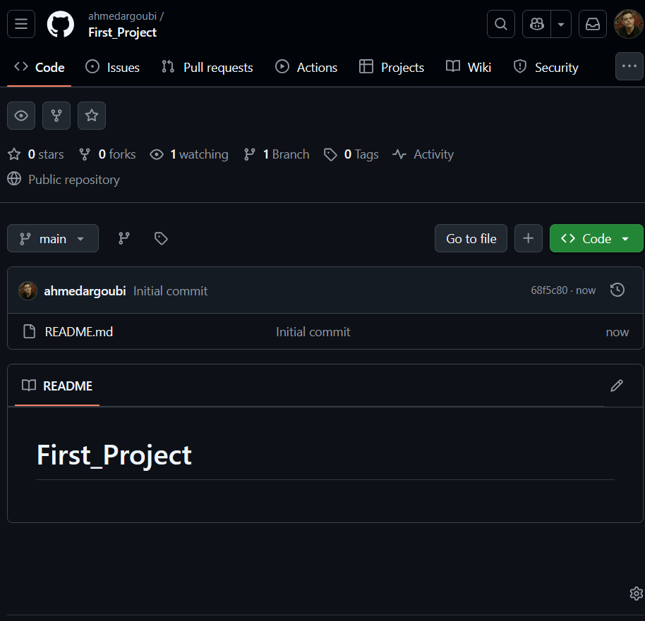

# TP2 : GitHub - Gestion de Dépôt Distant avec Git

## Objectifs :
- Apprendre à utiliser **GitHub** pour la gestion de versions.
- Comprendre les concepts de **clonage**, **commit**, **push**, et **pull**.
- Travailler avec des fichiers suivis par **Git**.

---

## A. Préparation initiale

1. **Créer un compte GitHub**
   - Aller sur [GitHub](https://github.com/).
   - Cliquer sur **Sign Up** et suivre les instructions pour créer un compte.

---

## B. Création du Repository Distant

2. **Créer un dépôt GitHub**
   - Se connecter à GitHub.
   - Aller sur **Repositories** > **New**.
   - Nommer le projet : `First_Project`.
   - Cocher **Public**.
   - Cliquer sur **Create Repository**.


3. **À quoi sert `.gitignore` ?**
   - `.gitignore` est un fichier qui permet d'ignorer certains fichiers lors du suivi par Git (ex: fichiers temporaires, logs).
  

4. **Créer un fichier et le committer sur GitHub**
   - Dans l’interface GitHub, aller dans le dépôt.
   - Cliquer sur **Add File** > **Create new file**.
   - Nommer `FirstFile.txt` et y écrire du contenu.
   - Valider avec **Commit new file**.

---

## C. Clonage du Projet

5. **Cloner le projet localement**
   - Copier l’URL HTTPS du projet GitHub.
   - Ouvrir un terminal et exécuter :
     ```sh
     git clone <URL_du_repository>
     ```

6. **Vérifier que le projet est bien cloné**
   ```sh
   ls First_Project
   ```

7. **Se positionner dans le projet cloné**
   ```sh
   cd First_Project
   ```

8. **Lister les fichiers existants**
   ```sh
   ls -a
   ```

---

## D. Gestion, Suivi et Vérification des Fichiers

9. **Créer un fichier en local**
   ```sh
   echo "Ceci est un fichier local" > LocalFile.txt
   ```

10. **Ajouter et committer le fichier**
    ```sh
    git add LocalFile.txt
    git commit -m "Ajout du fichier LocalFile"
    ```

11. **Vérifier le suivi du fichier et afficher le log**
    ```sh
    git status
    git log --oneline
    ```

12. **Vérifier l’existence du fichier sur GitHub**
    - Taper :
      ```sh
      git push origin main
      ```
      
    - Vérifier sur GitHub que `LocalFile.txt` est bien ajouté.

    - **Pourquoi n’était-il pas sur GitHub avant ?**
      - Car `git add` et `git commit` ne modifient que le dépôt local.
      - Il faut un `git push` pour envoyer les changements vers le dépôt distant.

---

## Conclusion
- Ce TP permet de comprendre les bases de Git et GitHub.
- Vous avez appris à créer, cloner, gérer et envoyer des fichiers à un dépôt distant.
