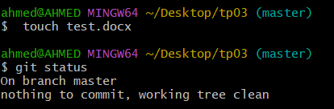
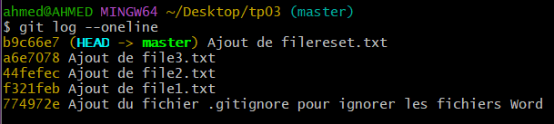
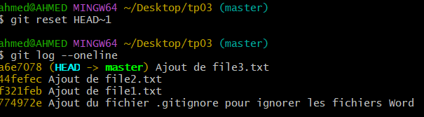
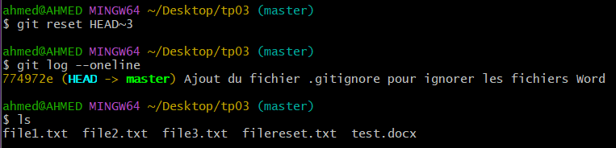
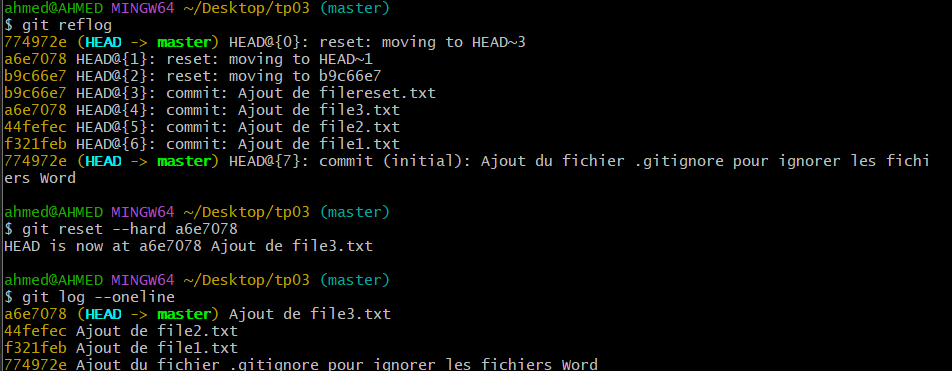
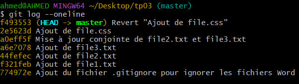

# TP3 : Git - Annulation et Rollback

## Objectifs :
- Comprendre comment annuler des modifications avec `git reset` et `git revert`.
- Différencier `git reset` et `git revert`.
- Utiliser `git reflog` pour récupérer des commits supprimés.
- Manipuler les options `--hard` et `--soft` de `git reset`.

---

## A. Création et Configuration du Projet

1. **Créer un dossier TP3 et l'initialiser avec Git**
   ```sh
   mkdir TP3
   cd TP3
   git init
   ```

2. **Créer un fichier `.gitignore` pour ignorer les fichiers `.docx`**
   ```sh
   echo "*.docx" > .gitignore
   git add .gitignore
   git commit -m "Ajout du fichier .gitignore pour ignorer les fichiers Word"
   ```

3. **Tester `.gitignore` en ajoutant un fichier Word**
   ```sh
   touch test.docx
   git status  # Vérifier que test.docx n'est pas suivi par Git
   ```
   
---

## B. Gestion des Commits et Annulations

4. **Créer un fichier `file1.txt` et le committer**
   ```sh
   echo "Contenu initial de file1" > file1.txt
   git add file1.txt
   git commit -m "Ajout de file1.txt"
   ```

5. **Créer et valider deux autres fichiers (`file2.txt`, `file3.txt`)**
   ```sh
   echo "Contenu file2" > file2.txt
   git add file2.txt
   git commit -m "Ajout de file2.txt"

   echo "Contenu file3" > file3.txt
   git add file3.txt
   git commit -m "Ajout de file3.txt"
   ```

6. **Créer et committer un fichier `filereset.txt`**
   ```sh
   echo "Contenu filereset" > filereset.txt
   git add filereset.txt
   git commit -m "Ajout de filereset.txt"
   ```

7. **Analyser l'historique des commits**
   ```sh
   git log --oneline 
   ```
   
---

## C. Annulation avec `git reset`

8. **Annuler définitivement le dernier commit**
   ```sh
   git reset --hard HEAD~1
   ```
   *Le fichier `filereset.txt` disparaît.*




9. **Supprimer les trois derniers commits mais garder les fichiers**
   ```sh
   git reset HEAD~3
   ```
   *Les fichiers sont encore présents mais non suivis par Git.*



10. **Récupérer l’état précédent grâce à `git reflog`**
    ```sh
    git reflog  # Trouver l'ID du commit précédent
    git reset --hard a6e7078
    ```
    
---

## D. Gestion avancée des commits

11. **Modifier `file3.txt` et faire un commit**
    ```sh
    echo "Ajout au file3" >> file3.txt
    git add file3.txt
    git commit -m "Mise à jour de file3.txt"
    ```

12. **Annuler le dernier commit sans perdre les modifications**
    ```sh
    git reset --soft HEAD^
    ```
    *Le commit est annulé, mais les fichiers sont toujours en staging.*

    

14. **Ajouter `file2.txt` et reformer un commit correct**
    ```sh
    git add file2.txt file3.txt
    git commit -m "Mise à jour conjointe de file2.txt et file3.txt"
    ```

---

## E. Annulation propre avec `git revert`

14. **Ajouter et committer `file.css`**
    ```sh
    echo "body { background-color: white; }" > file.css
    git add file.css
    git commit -m "Ajout de file.css"
    ```

15. **Annuler le dernier commit sans modifier les fichiers**
    ```sh
    git revert HEAD
    ```
    *Cela ouvre un éditeur de texte (Vim ou Nano) pour confirmer le commit de revert.*
    *Si l'éditeur s'ouvre, tape `:wq` sous Vim pour enregistrer et quitter.*



---

## F. Résumé des commandes utilisées
| Commande | Effet |
|----------|------|
| `git reset --hard HEAD~1` | Supprime définitivement le dernier commit et les fichiers associés |
| `git reset HEAD~3` | Supprime les 3 derniers commits mais garde les fichiers en local |
| `git reflog` | Affiche l'historique des commits supprimés |
| `git reset --soft HEAD^` | Annule le dernier commit mais garde les fichiers en staging |
| `git revert HEAD` | Annule le dernier commit en générant un commit inverse et ouvre un éditeur pour confirmer |

---

### **Conclusion**
- `git reset` permet d’annuler un commit et peut modifier l'historique.
- `git revert` est plus sûr car il conserve l’historique en créant un commit inverse.
- `git reflog` permet de récupérer des commits supprimés.

📌 *Pour plus d’informations, consultez la [documentation Git](https://git-scm.com/doc).*
