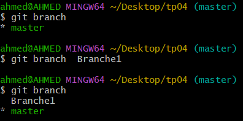
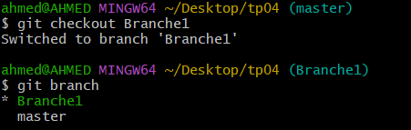
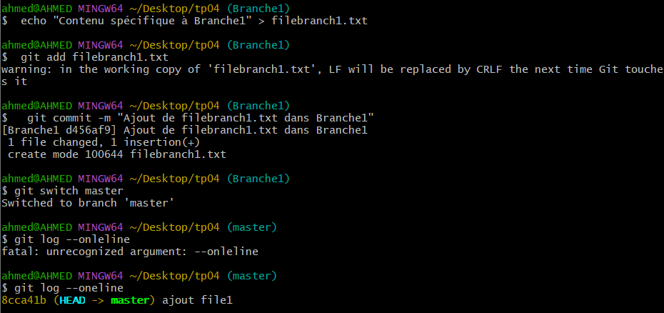
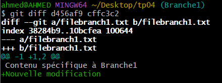
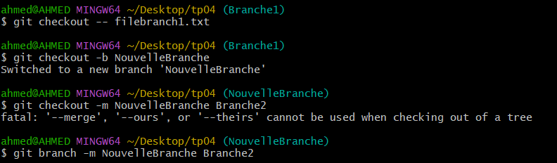

# LAB4 : Git - Gestion des Branches

## Objectifs :
- Travailler simultanément avec plusieurs versions du code source.
- Créer et gérer des branches Git.
- Passer d'une branche à une autre et observer l'effet des commits.

---

## A. Vérification et Création des Branches

1. **Lister les branches existantes**
   ```sh
   git branch
   ```
   - Affiche la liste des branches locales.
   - `*` indique la branche actuellement active.

2. **Créer une nouvelle branche `Branche1`**
   ```sh
   git branch Branche1
   ```

3. **Vérifier la création de la branche**
   ```sh
   git branch
   ```

4. **Passer à la branche `Branche1`**
   ```sh
   git checkout Branche1
   ```
 

5. **Vérifier la branche active**
   ```sh
   git branch
   ```
   - `Branche1` doit être marquée avec `*`.
 
---

## B. Ajout et Validation de Fichiers sur une Branche

6. **Ajouter un fichier `filebranch1.txt` et le committer**
   ```sh
   echo "Contenu spécifique à Branche1" > filebranch1.txt
   git add filebranch1.txt
   git commit -m "Ajout de filebranch1.txt dans Branche1"
   ```

7. **Retourner à la branche principale et observer les commits**
   ```sh
   git checkout master
   git log --oneline 
   ```
   - Le commit de `filebranch1.txt` n’apparaît pas sur `master`, car il est sur `Branche1`.

     
---

## C. Gestion du Dépôt Distant

8. **Vérifier si un dépôt distant est configuré**
   ```sh
   git remote -v
   ```
   - Si aucun dépôt n'est listé, ajouter un dépôt distant :
   ```sh
   git remote add origin https://github.com/ton_utilisateur/nom_du_depot.git
   ```

9. **Pousser la branche `Branche1` sur GitHub**
   ```sh
   git push -u origin Branche1
   ```
   - **Que remarquez-vous ?**
     - Si la branche est poussée avec succès, elle apparaît sur GitHub.
     - Si une erreur survient (`fatal: 'origin' does not appear to be a git repository`), assurez-vous que le dépôt distant est bien configuré avec `git remote -v`.
     - Vérifiez également vos permissions et votre authentification sur GitHub.

---

## D. Comparaison des Modifications

10. **Modifier le fichier et comparer les changements**
    ```sh
    echo "Nouvelle modification" >> filebranch1.txt
    git diff filebranch1.txt
    ```

11. **Comparer les deux derniers commits**
    ```sh
    git diff ID_commit1 ID_commit2
    ```

12. **Afficher uniquement les fichiers modifiés entre deux commits**
    ```sh
    git diff ID_commit1 ID_commit2 --name-only
    ```

    
---

## E. Gestion des Erreurs et Corrections

13. **Annuler les modifications locales sur un fichier**
    ```sh
    git checkout -- filebranch1.txt
    ```

14. **Créer et basculer directement vers une nouvelle branche**
    ```sh
    git checkout -b NouvelleBranche
    ```

15. **Renommer une branche**
    ```sh
    git branch -m AncienNom NouveauNom
    ```

 


---

## Conclusion
- L’utilisation des branches permet de travailler sur plusieurs versions du projet sans interférer avec `master`.
- `git push origin Branche1` permet d’envoyer une branche vers GitHub après configuration correcte du dépôt distant.
- `git diff` aide à visualiser les différences entre commits.

📌 *Pour plus d’informations, consultez la [documentation Git](https://git-scm.com/doc).*
