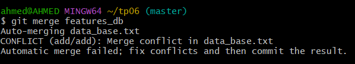
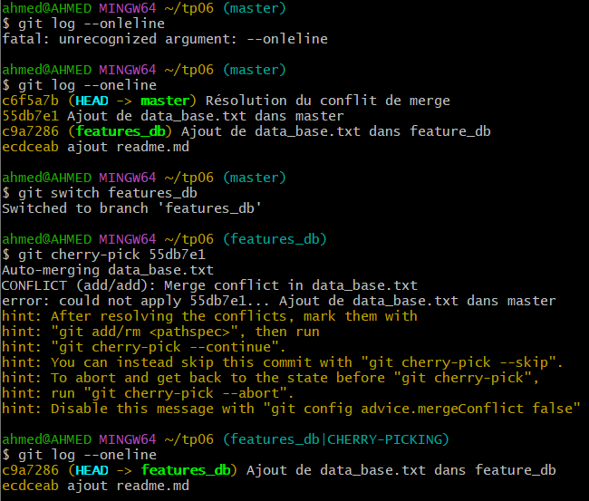

# TP6 : Git - Gestion des Conflits de Merge

## Objectifs :
- Créer des branches et naviguer entre elles.
- Fusionner des branches et gérer les conflits.
- Utiliser `git stash` pour sauvegarder des modifications temporaires.
- Copier des commits spécifiques avec `git cherry-pick`.

---

## A. Création et Gestion des Branches

1. **Créer une branche `feature_db` et s'y positionner**
   ```sh
   
   git checkout -b feature_db
   ```
  

2. **Créer et committer un fichier `data_base.db` dans `feature_db`**
   ```sh
   echo "this is feature_db branch source code" > data_base.db
   git add data_base.db
   git commit -m "Ajout de data_base.db dans feature_db"
   ```

3. **Revenir à `master`, créer un fichier avec le même nom et le committer**
   ```sh
   git checkout master
   echo "this is main branch source code" > data_base.db
   git add data_base.db
   git commit -m "Ajout de data_base.db dans master"
   ```

---

## B. Fusion et Gestion des Conflits

4. **Fusionner `feature_db` dans `master`**
   ```sh
   git merge feature_db
   ```
   - **Que se passe-t-il ?**
     - Un **conflit de merge** est détecté sur `data_base.db` car les deux branches ont des modifications différentes sur le même fichier.

 


5. **Résoudre le conflit de merge**
   - Ouvrir `data_base.db` et choisir la version appropriée.
   - Marquer le conflit comme résolu :
     ```sh
     git add data_base.db
     git commit -m "Résolution du conflit de merge"
     ```

---

## C. Gestion des Modifications Temporaires avec `git stash`

6. **Sauvegarder des modifications sans commit avec `git stash`**
   ```sh
   git stash
   ```
   - Permet de sauvegarder l’état actuel du projet sans committer.
  

---

## D. Copier un Commit d'une Branche à une Autre avec `git cherry-pick`

7. **Copier un commit spécifique vers une autre branche**
   - Trouver l'ID du commit avec :
     ```sh
     git log --oneline
     ```
   - Copier le commit sur une autre branche :
     ```sh
     git checkout 
     git cherry-pick 55db7e1

     ```

      


---

## Conclusion
- Un conflit de fusion survient lorsque des modifications différentes sont apportées au même fichier.
- `git stash` est utile pour enregistrer temporairement des changements sans commit.
- `git cherry-pick` permet d’extraire un commit spécifique d’une branche à une autre.

📌 *Pour plus d’informations, consultez la [documentation Git](https://git-scm.com/doc).*
